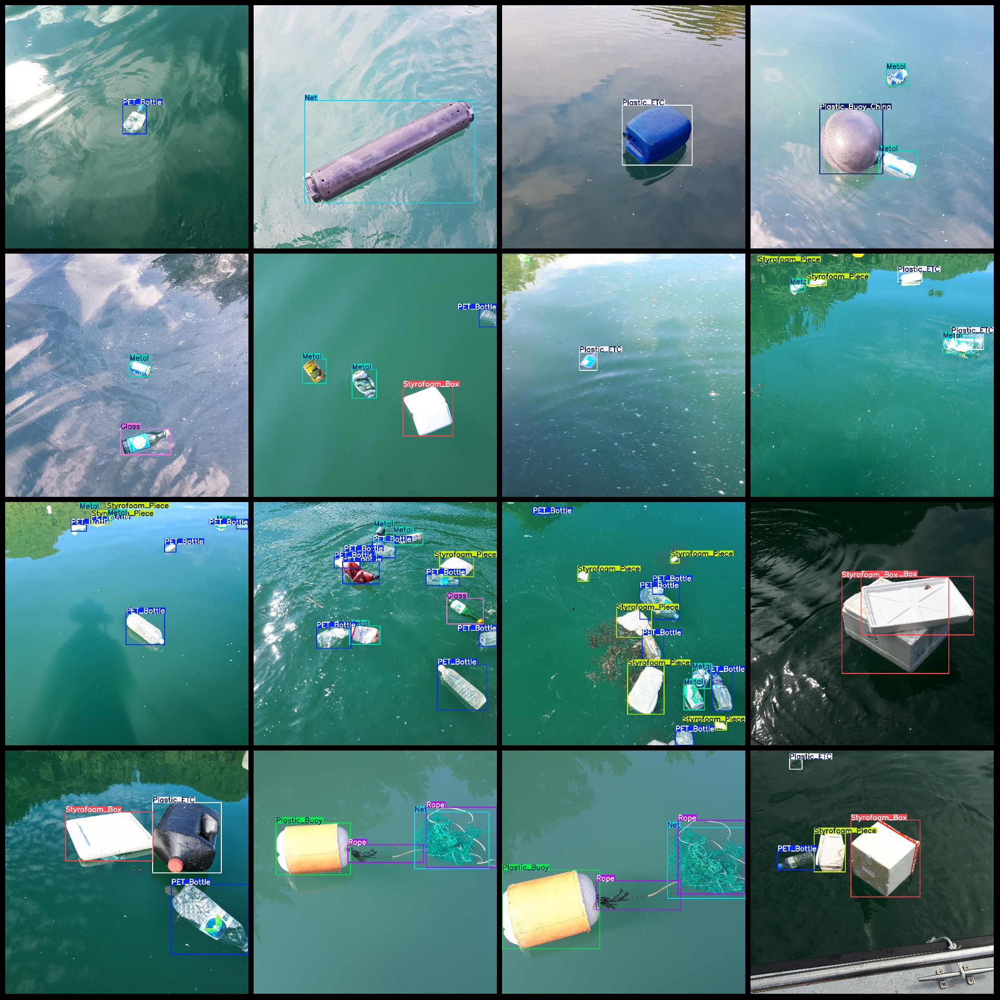
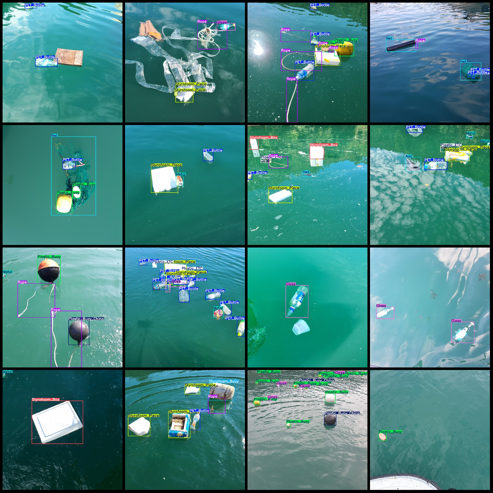

# Drone-Viewed Riverine Debris and Water Floating Objects Metal Plastic Bottles Detection Dataset in VOC+YOLO format with 1297 images across 11 categories

Dataset format: Pascal VOC format + YOLO format (txt files without split path, only containing jpg images and corresponding VOC format xml files and yolo format txt files)
Number of images (jpg file count): 1297
Number of annotations (xml file count): 1297
Number of annotations (txt file count): 1297
Number of annotation categories: 11
Annotation category names: ["Glass", "Metal", "Net", "PET_Bottle", "Plastic_Buoy", "Plastic_Buoy_China", "Plastic_ETC", "Rope", "Styrofoam_Box", "Styrofoam_Buoy", "Styrofoam_Piece"]
Each category annotation boxes:
Glass boxes = 613
Metal boxes = 977
Net boxes = 308
PET bottle boxes = 2325
Plastic buoy boxes = 970
Plastic buoy China boxes = 121
Plastic ETC boxes = 634
Rope boxes = 586
Styrofoam_Box = 210
96
Frames = 995
Total frames: 7835
Image resolution: 2048x2048
Drone: DJI MAVIC 3
Sampling height: 3-5m  
Sampling angle: 60°
Using a labeling tool: labelImg
Rule: Draw a rectangle around the category.
Important Notice: None
Special Disclaimer: This dataset does not guarantee the accuracy of the trained model or weight file.
Preview of the image:
## Images

Here is a pay link on Stripe ( https://buy.stripe.com/3cs8yP7sY87d0vu9AB ). Please contact me lonlonago@foxmail.com after funding $89, and I will send you a complete data files , thank you!

